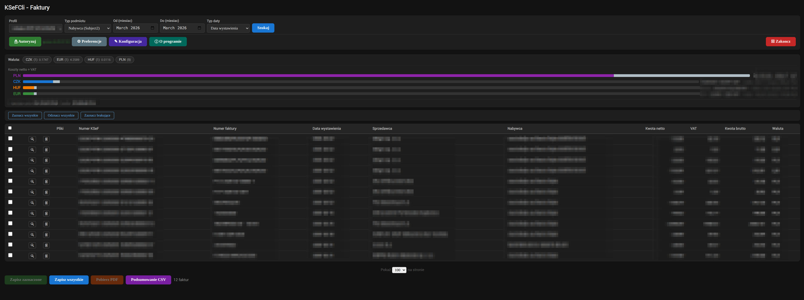
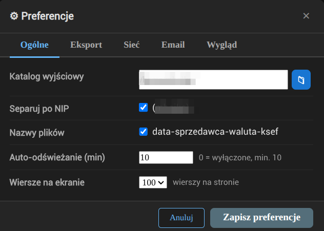
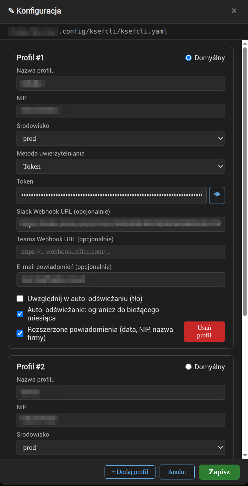

# ksefcli — GUI

**PL** | [EN](#english)

---

## Polski

> **Fork** — ten projekt jest forkiem [kamilcuk/ksefcli](https://github.com/kamilcuk/ksefcli) autorstwa [Kamila Cukrowskiego](https://github.com/kamilcuk). Oryginalne repozytorium zawiera wersję CLI; ten fork dodaje rozbudowany interfejs przeglądarkowy (GUI) oraz dodatkowe funkcje.

`ksefcli` to narzędzie do pobierania faktur z **Krajowego Systemu e-Faktur (KSeF)**. Oprócz interfejsu wiersza poleceń posiada wbudowany interfejs przeglądarkowy (GUI), który uruchamia się lokalnie i nie wymaga instalacji dodatkowego oprogramowania.

### Wymagania

- Plik wykonywalny `ksefcli` (Linux / Windows / macOS) — samowystarczalny, brak zależności .NET
- Przeglądarka internetowa

Eksport PDF **nie wymaga** Node.js, git ani żadnych zewnętrznych narzędzi — generator PDF jest wbudowany w aplikację.

### Instalacja

Pobierz najnowszy plik binarny dla swojej platformy ze strony [Releases](https://github.com/marcinbojko/ksef-gui/releases).

#### Windows

Umieść `ksefcli-win-x64.exe` w wybranym folderze (możesz zmienić nazwę na `ksefcli.exe`).

#### macOS

Umieść `ksefcli-osx-arm64` (Apple Silicon) lub `ksefcli-osx-x64` (Intel) w wybranym miejscu i nadaj uprawnienia do wykonania:

```bash
chmod +x ksefcli-osx-arm64
```

Plik pobrany z internetu jest domyślnie objęty kwarantanną macOS (Gatekeeper), co blokuje ładowanie natywnych bibliotek i powoduje błąd przy generowaniu PDF. Usuń atrybut kwarantanny przed pierwszym uruchomieniem:

```bash
xattr -dr com.apple.quarantine ksefcli-osx-arm64
```

#### Linux

Umieść `ksefcli-linux-x64` w wybranym miejscu i nadaj uprawnienia do wykonania:

```bash
chmod +x ksefcli-linux-x64
```

---

### Szybki start

```bash
./ksefcli
# Przeglądarka otwiera się automatycznie pod adresem http://localhost:<port>
```

Polecenie `Gui` jest domyślne — samo uruchomienie pliku wykonywalnego (np. dwuklikiem w systemie Windows) otwiera GUI.

Przy pierwszym uruchomieniu bez pliku konfiguracyjnego — GUI otwiera **kreator konfiguracji** automatycznie.

### Plik konfiguracyjny

`ksefcli` szuka pliku `ksefcli.yaml` w następującej kolejności:

| Priorytet | Lokalizacja |
|-----------|-------------|
| 1 | Flaga `-c /sciezka/do/pliku` |
| 2 | Zmienna środowiskowa `KSEFCLI_CONFIG` |
| 3 | `./ksefcli.yaml` — bieżący katalog roboczy |
| 4 | `<katalog-exe>/ksefcli.yaml` — katalog obok pliku wykonywalnego |
| 5 | `~/.config/ksefcli/ksefcli.yaml` — domyślna lokalizacja |

Najwygodniejsze podejście: umieść `ksefcli.yaml` obok pliku wykonywalnego — działa z dowolnego miejsca.

Na starcie aplikacja wypisuje, który plik został wczytany:
```
Config: /home/user/.config/ksefcli/ksefcli.yaml [default (~/.config/ksefcli/)]
```

#### Format pliku konfiguracyjnego

```yaml
active_profile: firma1

profiles:
  firma1:
    environment: prod      # test | demo | prod
    nip: "1234567890"
    token: "TWOJ_TOKEN_KSEF"

  firma2:
    environment: prod
    nip: "9876543210"
    certificate:
      private_key_file: ~/certyfikaty/klucz.pem
      certificate_file: ~/certyfikaty/cert.pem
      password_env: KSEF_CERT_PASSWORD
```

Jeśli zdefiniowany jest tylko jeden profil, `active_profile` jest opcjonalne.

Token długoterminowy uzyskasz w portalu KSeF: *Integracja → Tokeny*.

### Uruchamianie GUI

```bash
# Podstawowe uruchomienie (Gui jest domyślne)
./ksefcli

# Z katalogiem wyjściowym i eksportem PDF
./ksefcli Gui -o ~/faktury --pdf

# Tryb LAN — dostęp z innych urządzeń w sieci
./ksefcli Gui --lan -o /data --pdf
```

| Opcja | Opis | Domyślnie |
|-------|------|-----------|
| `-o`, `--outputdir` | Katalog zapisu faktur | `.` |
| `-p`, `--pdf` | Generuj pliki PDF przy pobieraniu | wyłączone |
| `--useInvoiceNumber` | Używaj numeru faktury zamiast numeru KSeF w nazwie pliku | wyłączone |
| `--lan` | Nasłuchuj na wszystkich interfejsach sieciowych | wyłączone |

### Funkcje GUI



**Wyszukiwanie faktur**
- Typ podmiotu: Sprzedawca / Nabywca / Subject3 / Authorized
- Zakres dat (wybieracz miesięcy), typ daty: Wystawienie / Sprzedaż / PermanentStorage
- Filtrowanie po walucie — przyciski walut budowane dynamicznie na podstawie wyników wyszukiwania

**Tabela wyników**
- Numer KSeF, numer faktury, data wystawienia, sprzedawca, nabywca, kwota brutto, waluta
- Wskaźniki statusu pliku — które faktury są już pobrane jako XML / PDF / JSON
- Podgląd szczegółów faktury po kliknięciu lupki (strony, pozycje, podsumowanie)

**Pobieranie**
- Zaznaczanie pojedynczych faktur lub wszystkich
- Wybór katalogu wyjściowego (przeglądarka folderów)
- Formaty eksportu: XML (domyślnie włączony), PDF (włączony przy `--pdf`), JSON
- Własny schemat nazw: `YYYY-MM-DD-Sprzedawca-Waluta-NumerKSeF`
- "Separuj po NIP" — tworzy podkatalog według NIP aktywnego profilu

**Status tokenu**
- Wyświetla czas ważności tokenu dostępu i tokenu odświeżania
- Kolorowy przycisk *Autoryzuj* (zielony / pomarańczowy / czerwony)
- Ponowna autoryzacja bez restartu

**⚙ Preferencje** (panel z zakładkami)

Zakładka **Ogólne**:
- Katalog wyjściowy, formaty eksportu (XML / PDF / JSON), schemat nazw plików
- Separacja po NIP (podkatalog = NIP aktywnego profilu)
- Wybór aktywnego profilu (zapamiętywany między sesjami; zmiana profilu działa natychmiast bez restartu)
- **Auto-odświeżanie** — cykliczne wyszukiwanie w tle co N minut (0 = wyłączone); gdy pojawiają się nowe faktury, wyświetlane są powiadomienia (pasek tytułu, toast, powiadomienie systemowe przeglądarki)

Zakładka **Eksport**:
- Szczegółowe opcje eksportu plików

Zakładka **Sieć**:
- Port nasłuchiwania (domyślnie `18150`) — zmiana wymaga restartu
- Tryb nasłuchiwania: **Tylko localhost** (domyślnie) lub **Sieć lokalna (0.0.0.0)**
- Wyświetla aktualny adres URL serwera

Zakładka **Wygląd**:
- Trzy niezależne tryby ciemne: interfejs GUI, podgląd faktury (HTML), szczegóły faktury
- Schemat kolorów PDF: Granatowy / Zielony / Szary
- Przycisk *Wyślij testowe powiadomienie* — weryfikacja uprawnień do powiadomień przeglądarki
- Przełącznik formatu logów konsoli: czytelny dla człowieka (domyślnie) lub JSON (dla CI/systemd)

Preferencje zapisywane są w: `~/.cache/ksefcli/gui-prefs.json`



**✎ Konfiguracja** (edytor w przeglądarce)
- Edycja profili: nazwa, NIP, środowisko, metoda uwierzytelnienia
- Pole tokenu z przełącznikiem widoczności
- Pola certyfikatu (plik klucza, plik certyfikatu, hasło/env/plik)
- Dodawanie i usuwanie profili
- Zmiany zapisywane natychmiast do `ksefcli.yaml`; lista profili odświeżana bez restartu



### Kreator pierwszego uruchomienia

Jeśli plik `ksefcli.yaml` nie istnieje:
1. GUI tworzy plik szablonowy w domyślnej lokalizacji
2. Pojawia się baner ostrzegawczy *"Brak konfiguracji"*
3. Przyciski wyszukiwania, pobierania i autoryzacji są zablokowane
4. Edytor konfiguracji otwiera się automatycznie

Po zapisaniu profilu — wszystkie przyciski odblokowują się bez restartu.

### Docker / serwer domowy

Dla uruchomienia na serwerze, NAS lub w środowisku Docker:

```bash
cp .env.example .env   # uzupełnij KSEFCLI_HOSTNAME i opcjonalnie KSEFCLI_BASICAUTH_USERS
docker compose up -d
```

#### Architektura

| Serwis | Rola |
|--------|------|
| **ksefcli** | GUI nasłuchuje na porcie `18150`, wystawione przez Traefik |
| **Traefik** | Reverse proxy — TLS (Let's Encrypt), HTTP→HTTPS redirect, opcjonalne basic-auth |
| **Ofelia** | Harmonogram zadań — rotacja logów, health-probe, opcjonalne czyszczenie starych faktur |

#### Sieć

Compose definiuje dwie wewnętrzne sieci (nie wymagają wcześniejszego tworzenia):

- **front** — Traefik ↔ ksefcli (ruch publiczny)
- **back** (izolowana, bez dostępu do internetu) — ksefcli ↔ ofelia

#### Zmienne środowiskowe (`.env`)

Skopiuj `.env.example` i dostosuj:

| Zmienna | Opis | Domyślnie |
|---------|------|-----------|
| `TZ` | Strefa czasowa | `Europe/Warsaw` |
| `TRAEFIK_TAG` | Tag obrazu Traefik | `v3.3` |
| `ACME_EMAIL` | E-mail do rejestracji Let's Encrypt (wymagany) | — |
| `TRAEFIK_CERT_RESOLVER` | Nazwa resolwera (`letsencrypt`, `cloudflare`…) | `letsencrypt` |
| `KSEFCLI_TAG` | Tag obrazu Docker | `latest` |
| `KSEFCLI_PORT` | Port wewnętrzny | `18150` |
| `KSEFCLI_HOSTNAME` | Hostname za Traefik (np. `ksef.example.com`) | — |
| `KSEFCLI_BASICAUTH_USERS` | Hash basic-auth (`htpasswd -nb user pass`) | wyłączone |
| `OFELIA_TAG` | Tag obrazu Ofelia | `latest` |

#### Ofelia — zadania cykliczne (`ofelia/config.ini`)

| Zadanie | Harmonogram | Opis |
|---------|-------------|------|
| `log-rotate` | `@daily` | Usuwa logi Serilog starsze niż 7 dni |
| `health-check` | `@every 5m` | Restartuje kontener jeśli healthcheck zawiedzie |
| `cleanup-old-invoices` | `@weekly` *(wyłączone)* | Usuwa faktury starsze niż 365 dni |

#### Woluminy i pliki

- `./output` — pobrane faktury pojawiają się bezpośrednio na hoście
- `./ksefcli.yaml` — edytujesz lokalnie, kontener odczytuje (`:ro`)
- `ksefcli-cache` — wolumin nazwany; tokeny i preferencje przeżywają `docker compose down/up`

### Eksport PDF

PDF jest generowany **natywnie przez wbudowany renderer** oparty na [QuestPDF](https://www.questpdf.com/) — czysta implementacja .NET, bez zewnętrznych zależności.

Nie jest wymagany Node.js, git ani żaden zewnętrzny generator. Eksport PDF działa identycznie na każdej platformie i w środowisku Docker.

#### Schemat kolorów

Wygląd nagłówków tabel i akcentów w PDF można zmienić w preferencjach GUI (zakładka ⚙):

| Schemat | Opis |
|---------|------|
| **Granatowy** (domyślny) | Ciemny niebieski — klasyczny, formalny wygląd |
| **Zielony** | Ciemna zieleń — świeży, ekologiczny akcent |
| **Szary** | Ciemny szary — neutralny, minimalistyczny |

Schemat dotyczy nagłówków tabel, obramowań sekcji i koloru akcentowego. Tło dokumentu zawsze białe, tekst czarny.

Konwersja z wiersza poleceń:

```bash
# Domyślny schemat (granatowy)
./ksefcli XML2PDF faktura.xml

# Wskazanie schematu
./ksefcli XML2PDF faktura.xml --color-scheme forest
./ksefcli XML2PDF faktura.xml wynik.pdf --color-scheme slate
```

---

## English

> **Fork** — this project is a fork of [kamilcuk/ksefcli](https://github.com/kamilcuk/ksefcli) by [Kamil Cukrowski](https://github.com/kamilcuk). The original repository provides a CLI tool; this fork adds a full browser-based GUI and additional features.

`ksefcli` is a tool for downloading invoices from Poland's **KSeF** (National e-Invoice System). In addition to its command-line interface it includes a built-in browser-based GUI that runs locally with no additional software required.

### Requirements

- `ksefcli` binary (Linux / Windows / macOS) — self-contained, no .NET runtime needed
- A web browser

PDF export **does not require** Node.js, git, or any external tools — the PDF renderer is built into the application.

### Installation

Download the latest binary for your platform from the [Releases](https://github.com/marcinbojko/ksef-gui/releases) page.

#### Windows

Place `ksefcli-win-x64.exe` in any folder (rename to `ksefcli.exe` if desired).

#### macOS

Place `ksefcli-osx-arm64` (Apple Silicon) or `ksefcli-osx-x64` (Intel) anywhere and make it executable:

```bash
chmod +x ksefcli-osx-arm64
```

Files downloaded from the internet are quarantined by macOS Gatekeeper, which prevents native libraries from loading and causes a crash on PDF generation. Clear the quarantine attribute before first run:

```bash
xattr -dr com.apple.quarantine ksefcli-osx-arm64
```

#### Linux

Place `ksefcli-linux-x64` anywhere and make it executable:

```bash
chmod +x ksefcli-linux-x64
```

---

### Quick start

```bash
./ksefcli
# Browser opens automatically at http://localhost:<port>
```

`Gui` is the default command — double-clicking the binary (e.g. on Windows) opens the GUI directly.

On first launch without a config file the GUI opens the **setup wizard** automatically.

### Configuration file

`ksefcli` searches for `ksefcli.yaml` in this order:

| Priority | Location |
|----------|----------|
| 1 | `-c /path/to/file` flag |
| 2 | `KSEFCLI_CONFIG` environment variable |
| 3 | `./ksefcli.yaml` — current working directory |
| 4 | `<exe-dir>/ksefcli.yaml` — same directory as the binary |
| 5 | `~/.config/ksefcli/ksefcli.yaml` — default fallback |

The most convenient setup: place `ksefcli.yaml` next to the binary — works from any directory.

On startup, ksefcli prints which file was loaded:
```
Config: /home/user/.config/ksefcli/ksefcli.yaml [default (~/.config/ksefcli/)]
```

#### Config file format

```yaml
active_profile: company1

profiles:
  company1:
    environment: prod      # test | demo | prod
    nip: "1234567890"
    token: "YOUR_KSEF_TOKEN_HERE"

  company2:
    environment: prod
    nip: "9876543210"
    certificate:
      private_key_file: ~/certs/private.key
      certificate_file: ~/certs/cert.pem
      password_env: KSEF_CERT_PASSWORD
```

If only one profile is defined, `active_profile` is optional.

Obtain a long-term token from the KSeF portal under *Integracja → Tokeny*.

### Running the GUI

```bash
# Basic (Gui is the default command)
./ksefcli

# With output directory and PDF export
./ksefcli Gui -o ~/invoices --pdf

# LAN mode — accessible from other devices on the network
./ksefcli Gui --lan -o /data --pdf
```

| Option | Description | Default |
|--------|-------------|---------|
| `-o`, `--outputdir` | Directory for saving invoices | `.` |
| `-p`, `--pdf` | Generate PDF files when downloading | off |
| `--useInvoiceNumber` | Use invoice number instead of KSeF number for filenames | off |
| `--lan` | Listen on all network interfaces | off |

### GUI features


**Invoice search**
- Subject type: Sprzedawca (seller) / Nabywca (buyer) / Subject3 / Authorized
- Date range (month picker), date type: Issue / Invoicing / PermanentStorage
- Per-currency filter chips — built dynamically from the current search results

**Results table**
- KSeF number, invoice number, issue date, seller, buyer, gross amount, currency
- File status indicators — which invoices are already downloaded as XML / PDF / JSON
- Click the magnifying glass to preview invoice details (parties, line items, totals)

**Download**
- Select individual invoices or all at once
- Folder picker for output directory
- Export formats: XML (default on), PDF (on with `--pdf`), JSON (default off)
- Custom filename pattern: `YYYY-MM-DD-SellerName-Currency-KsefNumber`
- "Separate by NIP" — creates a subdirectory named after the active profile's NIP

**Token status**
- Displays access token and refresh token expiry times
- Colour-coded Autoryzuj button (green / orange / red)
- Re-authenticate without restarting

**⚙ Preferences** (tabbed panel)

**General** tab:
- Output directory, export formats (XML / PDF / JSON), filename style
- Separate-by-NIP option (subdirectory = active profile's NIP)
- Active profile selection (persisted across sessions; switching takes effect immediately without restart)
- **Auto-refresh** — background search every N minutes (0 = disabled); when new invoices appear, notifications are shown (page title badge, in-page toast, browser Web Notification)

**Export** tab:
- Detailed file export options

**Network** tab:
- Listening port (default `18150`) — change takes effect on next restart
- Listen mode: **Localhost only** (default) or **All interfaces (0.0.0.0)**
- Displays the current server URL

**Appearance** tab:
- Three independent dark modes: GUI interface, invoice HTML preview, invoice details panel
- PDF colour scheme: Navy / Forest / Slate
- *Send test notification* button — verify browser notification permissions
- Console log format toggle: human-readable (default) or JSON (for CI/systemd)

Preferences stored at: `~/.cache/ksefcli/gui-prefs.json`


**✎ Konfiguracja** (in-browser config editor)
- Edit profiles: name, NIP, environment, auth method
- Token field with show/hide toggle
- Certificate fields (key file, cert file, password / env var / file)
- Add and delete profiles
- Saves immediately to `ksefcli.yaml`; profile dropdown refreshes without restart


### First-run wizard

If `ksefcli.yaml` does not exist at startup:
1. GUI creates a template config at the default path
2. An amber warning banner appears: *"Brak konfiguracji"*
3. Search, download, and auth buttons are disabled
4. Config editor opens automatically

After saving a profile, all buttons re-enable — no restart needed.

### Docker / home server

For running on a server, NAS, or in a Docker environment:

```bash
cp .env.example .env   # set KSEFCLI_HOSTNAME and optionally KSEFCLI_BASICAUTH_USERS
docker compose up -d
```

#### Architecture

| Service | Role |
|---------|------|
| **ksefcli** | GUI listening on port `18150`, exposed via Traefik |
| **Traefik** | Reverse proxy — TLS (Let's Encrypt), HTTP→HTTPS redirect, optional basic-auth |
| **Ofelia** | Job scheduler — log rotation, health probe, optional old-invoice cleanup |

#### Networks

Two internal networks (no pre-creation required):

- **front** — Traefik ↔ ksefcli (public-facing traffic)
- **back** (isolated, no direct internet) — ksefcli ↔ ofelia only

#### Environment variables (`.env`)

Copy `.env.example` and adjust:

| Variable | Description | Default |
|----------|-------------|---------|
| `TZ` | Timezone | `Europe/Warsaw` |
| `TRAEFIK_TAG` | Traefik image tag | `v3.3` |
| `ACME_EMAIL` | Let's Encrypt registration email (required) | — |
| `TRAEFIK_CERT_RESOLVER` | Cert resolver name (`letsencrypt`, `cloudflare`…) | `letsencrypt` |
| `KSEFCLI_TAG` | Docker image tag | `latest` |
| `KSEFCLI_PORT` | Internal port | `18150` |
| `KSEFCLI_HOSTNAME` | Hostname behind Traefik (e.g. `ksef.example.com`) | — |
| `KSEFCLI_BASICAUTH_USERS` | Basic-auth hash (`htpasswd -nb user pass`) | disabled |
| `OFELIA_TAG` | Ofelia image tag | `latest` |

#### Ofelia scheduled jobs (`ofelia/config.ini`)

| Job | Schedule | Description |
|-----|----------|-------------|
| `log-rotate` | `@daily` | Deletes Serilog log files older than 7 days |
| `health-check` | `@every 5m` | Restarts container if healthcheck fails |
| `cleanup-old-invoices` | `@weekly` *(disabled)* | Deletes invoices older than 365 days |

#### Volumes and files

- `./output` — downloaded invoices appear directly on the host
- `./ksefcli.yaml` — edit on the host; the container reads it (`:ro`)
- `ksefcli-cache` — named volume; tokens and preferences survive `docker compose down/up`

### PDF export

PDFs are rendered by a **native built-in engine** based on [QuestPDF](https://www.questpdf.com/) — a pure .NET library with no external dependencies.

Node.js, git, and any external generator are no longer required. PDF export works identically on all platforms and inside Docker with no additional setup.

#### Colour schemes

The look of table headers and accents can be changed in the GUI preferences (⚙ tab):

| Scheme | Description |
|--------|-------------|
| **Navy** (default) | Dark navy blue — classic, formal look |
| **Forest** | Dark green — fresh accent |
| **Slate** | Dark grey — neutral, minimalist |

The scheme affects table header backgrounds, section border colours, and the brand accent. Document background is always white; body text is always black.

Command-line conversion:

```bash
./ksefcli XML2PDF invoice.xml
./ksefcli XML2PDF invoice.xml output.pdf --color-scheme forest
./ksefcli XML2PDF invoice.xml output.pdf --color-scheme slate
```

---

*Full CLI reference: [README.ksefcli.md](README.ksefcli.md)*
*License: [GPLv3](LICENSE.md)*
