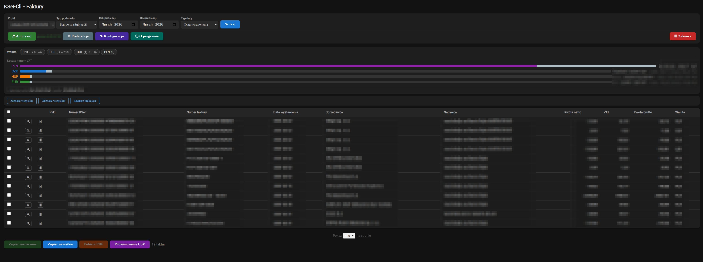
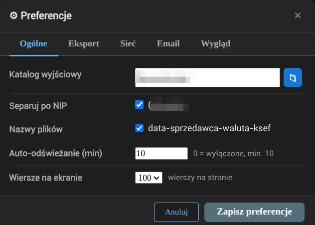
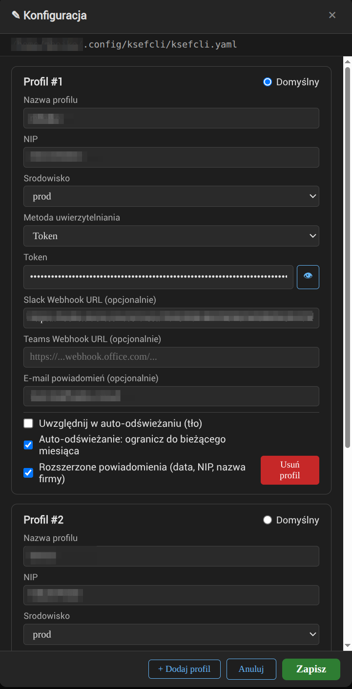

<div align="center">


# ksefcli

**Klient KSeF ze wbudowanym interfejsem przeglądarkowym**<br/>
**KSeF client with a built-in browser GUI**

[](https://github.com/marcinbojko/ksef-gui/releases)
[](https://github.com/marcinbojko/ksef-gui/actions/workflows/ci.yml)
[](https://github.com/marcinbojko/ksef-gui/actions/workflows/codeql.yml)
[](LICENSE.md)
[](#-instalacja)

<br/>

[🇵🇱 Polski](#polski) · [🇬🇧 English](#english)

</div>

---

## Polski

> **Fork** projektu [kamilcuk/ksefcli](https://github.com/kamilcuk/ksefcli) autorstwa [Kamila Cukrowskiego](https://github.com/kamilcuk). Oryginalne repozytorium zawiera wersję CLI; ten fork dodaje rozbudowany interfejs przeglądarkowy i dodatkowe funkcje.

`ksefcli` to narzędzie do pobierania faktur z **Krajowego Systemu e-Faktur (KSeF)**. Oprócz CLI posiada wbudowany interfejs przeglądarkowy uruchamiany lokalnie — bez instalowania dodatkowego oprogramowania.

### ✨ Cechy

|                           |                                                                                           |
| ------------------------- | ----------------------------------------------------------------------------------------- |
| 🌐 **GUI w przeglądarce** | Interfejs lokalny dostępny bez instalacji                                                 |
| 📄 **Eksport PDF**        | Natywny renderer (QuestPDF) — bez Node.js, git ani zewnętrznych narzędzi                  |
| 🔄 **Auto-odświeżanie**   | Wyszukiwanie w tle co N minut; powiadomienia o nowych fakturach                           |
| 🔔 **Powiadomienia**      | Powiadomienia OS, webhooki Slack / Teams oraz e-mail (SMTP) per profil                    |
| 💾 **Cache SQLite**       | Wyniki wyszukiwania przechowywane lokalnie; przełączanie profili bez ponownego pobierania |
| 🌙 **Tryb ciemny**        | Trzy niezależne tryby: GUI, podgląd faktury, szczegóły                                    |
| 🐳 **Docker**             | Gotowy `docker-compose` z Traefik i Ofelia                                                |
| 🔒 **Bez internetu**      | Walidacja XSD i generowanie PDF działają w pełni offline                                  |

### 📸 Zrzuty ekranu

<div align="center">


_Główny ekran — lista faktur_


_Panel preferencji_


_Edytor konfiguracji_

</div>

### 📦 Instalacja

Pobierz najnowszy plik binarny ze strony [Releases](https://github.com/marcinbojko/ksef-gui/releases).

<details>
<summary><b>🪟 Windows</b></summary>

Umieść `ksefcli-win-x64.exe` w wybranym folderze (możesz zmienić nazwę na `ksefcli.exe`).

Dwukliknięcie pliku uruchamia GUI automatycznie.

</details>

<details>
<summary><b>🍎 macOS</b></summary>

```bash
# Apple Silicon
chmod +x ksefcli-osx-arm64
xattr -dr com.apple.quarantine ksefcli-osx-arm64

# Intel
chmod +x ksefcli-osx-x64
xattr -dr com.apple.quarantine ksefcli-osx-x64
```

> Usunięcie atrybutu kwarantanny jest wymagane — bez tego Gatekeeper blokuje ładowanie natywnych bibliotek.

</details>

<details>
<summary><b>🐧 Linux</b></summary>

```bash
chmod +x ksefcli-linux-x64   # lub ksefcli-linux-arm64
```

</details>

### 🚀 Szybki start

```bash
./ksefcli
# Przeglądarka otwiera się automatycznie pod adresem http://localhost:<port>
```

Przy pierwszym uruchomieniu bez pliku konfiguracyjnego GUI otwiera **kreator konfiguracji** automatycznie.

### ⚙ Plik konfiguracyjny

`ksefcli` szuka pliku `ksefcli.yaml` w następującej kolejności:

| Priorytet | Lokalizacja                                   |
| :-------: | --------------------------------------------- |
|     1     | Flaga `-c /sciezka/do/pliku`                  |
|     2     | Zmienna środowiskowa `KSEFCLI_CONFIG`         |
|     3     | `./ksefcli.yaml` — bieżący katalog            |
|     4     | `<katalog-exe>/ksefcli.yaml`                  |
|     5     | `~/.config/ksefcli/ksefcli.yaml` _(domyślne)_ |

```yaml
active_profile: firma1

profiles:
  firma1:
    environment: prod # test | demo | prod
    nip: "1234567890"
    token: "TWOJ_TOKEN_KSEF"

  firma2:
    environment: prod
    nip: "9876543210"
    certificate:
      private_key_file: ~/certyfikaty/klucz.pem
      certificate_file: ~/certyfikaty/cert.pem
      password_env: KSEF_CERT_PASSWORD
```

Token długoterminowy: portal KSeF → _Integracja → Tokeny_.

### 🖥 Uruchamianie GUI

```bash
./ksefcli                              # domyślnie uruchamia GUI
./ksefcli Gui -o ~/faktury --pdf       # z katalogiem wyjściowym i PDF
./ksefcli Gui --lan -o /data --pdf     # tryb LAN
```

| Opcja                | Opis                                 | Domyślnie |
| -------------------- | ------------------------------------ | :-------: |
| `-o`, `--outputdir`  | Katalog zapisu faktur                |    `.`    |
| `--pdf`              | Generuj PDF przy pobieraniu          | wyłączone |
| `--useInvoiceNumber` | Nazwa pliku wg numeru faktury        | wyłączone |
| `--lan`              | Nasłuchuj na wszystkich interfejsach | wyłączone |

### 🔔 Powiadomienia

Aplikacja obsługuje trzy kanały powiadomień o nowych fakturach, konfigurowane **per profil** w edytorze konfiguracji (przycisk ✎ Konfiguracja):

#### Powiadomienia systemowe (OS)

Przeglądarka wysyła natywne powiadomienie pulpitu przy każdym nowym zestawie faktur wykrytym w tle. Wymagana zgoda przeglądarki — przy pierwszym uruchomieniu zostaniesz o nią zapytany.

#### Slack

Wklej adres Incoming Webhook Slacka w polu **Slack Webhook URL** dla danego profilu.

```
https://hooks.slack.com/services/T.../B.../...
```

#### Microsoft Teams

Wklej adres Incoming Webhook Teams w polu **Teams Webhook URL** dla danego profilu.

```
https://xxx.webhook.office.com/webhookb2/...
```

#### E-mail (SMTP)

Skonfiguruj serwer SMTP w **Preferencjach** (zakładka **Email**):

| Pole             | Opis                                                        | Domyślnie  |
| ---------------- | ----------------------------------------------------------- | ---------- |
| Serwer SMTP      | Adres serwera, np. `smtp.gmail.com`                         | —          |
| Protokół         | `StartTLS` (port 587); `Brak` — bez szyfrowania             | `StartTLS` |
| Port             | Ustawiany automatycznie po wyborze protokołu                | `587`      |
| Użytkownik       | Nazwa użytkownika / login                                   | —          |
| Hasło            | Hasło SMTP lub hasło aplikacji                              | —          |
| Adres nadawcy    | Nagłówek `From:` (gdy pusty — używany jest login)           | —          |

Adres odbiorcy konfigurowany jest **osobno dla każdego profilu** w edytorze konfiguracji (pole **Adres e-mail powiadomień**). Zakładka Email zawiera przycisk **Wyślij test** umożliwiający weryfikację konfiguracji — wystarczy podać adres odbiorcy i kliknąć przycisk.

> **Uwaga:** Obsługiwany jest wyłącznie protokół STARTTLS (port 587). Implicit SSL (SMTPS, port 465) nie jest obsługiwany.

#### Rozszerzone powiadomienia

Dla każdego profilu dostępny jest checkbox **Rozszerzone powiadomienia** w edytorze konfiguracji. Gdy włączony, każda wiadomość zawiera szczegóły wykrytych faktur:

| Pole           | Opis                    |
| -------------- | ----------------------- |
| Data           | Data wystawienia        |
| NIP            | NIP sprzedawcy          |
| Nazwa firmy    | Nazwa sprzedawcy        |

Gdy wyłączony — wysyłana jest tylko informacja o liczbie nowych faktur.

#### Weryfikacja konfiguracji

W edytorze konfiguracji widoczny jest przycisk **🔔 Testuj** dla każdego profilu — wysyła próbną wiadomość do skonfigurowanych kanałów i zwraca wynik (sukces lub błąd z kodem HTTP i treścią odpowiedzi). Jeśli włączone są rozszerzone powiadomienia, test wysyłany jest z przykładowymi danymi faktur.

> Powiadomienia wysyłane są wyłącznie dla profili z włączonym **auto-odświeżaniem** (checkbox _Uwzględnij w auto-odświeżaniu_). Każda faktura jest notyfikowana tylko raz (zapisana w bazie SQLite), więc restart aplikacji nie powoduje powtórnych powiadomień.

#### Zakres dat w auto-odświeżaniu

W edytorze konfiguracji dla każdego profilu dostępne są ustawienia sterujące zakresem wyszukiwania podczas auto-odświeżania:

| Ustawienie                                    | Opis                                                                                                    |
| --------------------------------------------- | ------------------------------------------------------------------------------------------------------- |
| **Auto-odświeżanie: ogranicz do bieżącego miesiąca** | Gdy włączone (domyślnie), data `Od` jest zawsze ustawiana na 1. dzień bieżącego miesiąca — niezależnie od ustawień GUI. Gdy wyłączone, `Od` pochodzi z ostatniego ręcznego wyszukiwania. |

Data `Do` jest zawsze ustawiana na bieżący moment — nigdy nie jest pobierana z GUI, co zapobiega pominięciu faktur po zmianie miesiąca.

### 🐳 Docker / serwer domowy

> ⚠️ Aplikacja **nie jest przeznaczona do wystawienia w internecie** — tylko sieć lokalna lub VPN.

```bash
cp .env.example .env
$EDITOR .env
docker compose up -d
```

**Architektura stosu:**

```text
Sieć lokalna (LAN)  :80 / :443
        │
   ┌────▼────┐   back   ┌──────────┐
   │ Traefik │ ◄──────► │ ksefcli  │
   │  proxy  │          │  :18150  │
   └─────────┘          └─────┬────┘
                              │
                        ┌─────▼────┐
                        │  Ofelia  │
                        │scheduler │
                        └──────────┘
```

| Serwis      | Obraz                                 | Rola                                                              |
| ----------- | ------------------------------------- | ----------------------------------------------------------------- |
| **Traefik** | `traefik:v3.6.7`                      | Reverse proxy — routing, TLS (DNS challenge), optional basic-auth |
| **ksefcli** | `ghcr.io/marcinbojko/ksef-gui:latest` | GUI — wyłącznie przez Traefik                                     |
| **Ofelia**  | `mcuadros/ofelia:latest`              | Harmonogram — rotacja logów, health-probe, czyszczenie faktur     |

<details>
<summary><b>Zmienne środowiskowe (.env)</b></summary>

| Zmienna                   | Opis                                                 | Domyślnie       |
| ------------------------- | ---------------------------------------------------- | --------------- |
| `TZ`                      | Strefa czasowa                                       | `Europe/Warsaw` |
| `TRAEFIK_TAG`             | Tag obrazu Traefik                                   | `v3.6.7`        |
| `KSEFCLI_TAG`             | Tag obrazu Docker                                    | `latest`        |
| `KSEFCLI_PORT`            | Port wewnętrzny                                      | `18150`         |
| `KSEFCLI_HOSTNAME`        | Hostname za Traefik                                  | —               |
| `KSEFCLI_BASICAUTH_USERS` | Hash basic-auth (`htpasswd -nb user pass`, `$`→`$$`) | wyłączone       |
| `OFELIA_TAG`              | Tag obrazu Ofelia                                    | `latest`        |

</details>

<details>
<summary><b>Woluminy</b></summary>

| Ścieżka               | Typ          | Opis                              |
| --------------------- | ------------ | --------------------------------- |
| `ksefcli-output`      | named volume | Pobrane faktury (`/data`)         |
| `ksefcli-config`      | named volume | `ksefcli.yaml`                    |
| `ksefcli-cache`       | named volume | Tokeny, preferencje, cache SQLite |
| `traefik-acme`        | named volume | Certyfikaty TLS Let's Encrypt     |
| `./ofelia/config.ini` | bind (ro)    | Harmonogram Ofelia                |

</details>

### 📄 Eksport PDF

PDF generowany **natywnie** przez [QuestPDF](https://www.questpdf.com/) — czysta implementacja .NET, bez zewnętrznych zależności.

```bash
./ksefcli XML2PDF faktura.xml                            # domyślny schemat (granatowy)
./ksefcli XML2PDF faktura.xml --color-scheme forest      # zielony
./ksefcli XML2PDF faktura.xml wynik.pdf --color-scheme slate  # szary
```

| Schemat             | Wygląd                         |
| ------------------- | ------------------------------ |
| `navy` _(domyślny)_ | Ciemny granat — klasyczny      |
| `forest`            | Ciemna zieleń — świeży akcent  |
| `slate`             | Ciemny szary — minimalistyczny |

---

## English

> **Fork** of [kamilcuk/ksefcli](https://github.com/kamilcuk/ksefcli) by [Kamil Cukrowski](https://github.com/kamilcuk). The original is a CLI tool; this fork adds a full browser-based GUI and additional features.

`ksefcli` is a tool for downloading invoices from Poland's **KSeF** (National e-Invoice System). It includes a built-in browser GUI that runs locally with no additional software required.

### ✨ Features

|                     |                                                                      |
| ------------------- | -------------------------------------------------------------------- |
| 🌐 **Browser GUI**  | Local interface, no installation needed                              |
| 📄 **PDF export**   | Native renderer (QuestPDF) — no Node.js, git, or external tools      |
| 🔄 **Auto-refresh**    | Background search every N minutes; OS notifications for new invoices    |
| 🔔 **Notifications**   | OS desktop notifications, Slack / Teams webhooks, and e-mail (SMTP) per profile |
| 💾 **SQLite cache**    | Search results stored locally; profile switching without re-fetching    |
| 🌙 **Dark mode**       | Three independent modes: GUI, invoice preview, details panel            |
| 🐳 **Docker**          | Ready-to-use `docker-compose` with Traefik and Ofelia                   |
| 🔒 **Offline**         | XSD validation and PDF generation work fully offline                    |

### 📸 Screenshots

<div align="center">


_Main screen — invoice list_


_Preferences panel_


_Configuration editor_

</div>

### 📦 Installation

Download the latest binary from [Releases](https://github.com/marcinbojko/ksef-gui/releases).

<details>
<summary><b>🪟 Windows</b></summary>

Place `ksefcli-win-x64.exe` in any folder (rename to `ksefcli.exe` if you like).

Double-clicking the binary launches the GUI automatically.

</details>

<details>
<summary><b>🍎 macOS</b></summary>

```bash
# Apple Silicon
chmod +x ksefcli-osx-arm64
xattr -dr com.apple.quarantine ksefcli-osx-arm64

# Intel
chmod +x ksefcli-osx-x64
xattr -dr com.apple.quarantine ksefcli-osx-x64
```

> The quarantine attribute must be removed — otherwise macOS Gatekeeper blocks native library loading and PDF generation crashes.

</details>

<details>
<summary><b>🐧 Linux</b></summary>

```bash
chmod +x ksefcli-linux-x64   # or ksefcli-linux-arm64
```

</details>

### 🚀 Quick start

```bash
./ksefcli
# Browser opens automatically at http://localhost:<port>
```

On first launch without a config file the GUI opens the **setup wizard** automatically.

### ⚙ Configuration

`ksefcli` searches for `ksefcli.yaml` in this order:

| Priority | Location                                     |
| :------: | -------------------------------------------- |
|    1     | `-c /path/to/file` flag                      |
|    2     | `KSEFCLI_CONFIG` environment variable        |
|    3     | `./ksefcli.yaml` — current directory         |
|    4     | `<exe-dir>/ksefcli.yaml`                     |
|    5     | `~/.config/ksefcli/ksefcli.yaml` _(default)_ |

```yaml
active_profile: company1

profiles:
  company1:
    environment: prod # test | demo | prod
    nip: "1234567890"
    token: "YOUR_KSEF_TOKEN_HERE"

  company2:
    environment: prod
    nip: "9876543210"
    certificate:
      private_key_file: ~/certs/private.key
      certificate_file: ~/certs/cert.pem
      password_env: KSEF_CERT_PASSWORD
```

Obtain a long-term token from the KSeF portal: _Integracja → Tokeny_.

### 🖥 Running the GUI

```bash
./ksefcli                               # default — launches GUI
./ksefcli Gui -o ~/invoices --pdf       # with output directory and PDF
./ksefcli Gui --lan -o /data --pdf      # LAN mode
```

| Option               | Description                      | Default |
| -------------------- | -------------------------------- | :-----: |
| `-o`, `--outputdir`  | Directory for saving invoices    |   `.`   |
| `--pdf`              | Generate PDF when downloading    |   off   |
| `--useInvoiceNumber` | Use invoice number for filenames |   off   |
| `--lan`              | Listen on all network interfaces |   off   |

### 🔔 Notifications

The app supports three notification channels for new invoices, configured **per profile** in the configuration editor (✎ Configuration button):

#### OS (desktop) notifications

The browser sends a native desktop notification whenever new invoices are detected in the background. Browser permission is required — you will be prompted on first use.

#### Slack

Paste an Incoming Webhook URL into the **Slack Webhook URL** field for the profile.

```
https://hooks.slack.com/services/T.../B.../...
```

#### Microsoft Teams

Paste an Incoming Webhook URL into the **Teams Webhook URL** field for the profile.

```
https://xxx.webhook.office.com/webhookb2/...
```

#### E-mail (SMTP)

Configure the SMTP server in **Preferences** (⚙ Preferences icon, **Email** tab):

| Field         | Description                                               | Default    |
| ------------- | --------------------------------------------------------- | ---------- |
| SMTP Server   | Server address, e.g. `smtp.gmail.com`                     | —          |
| Protocol      | `StartTLS` (port 587); `None` — unencrypted               | `StartTLS` |
| Port          | Set automatically when protocol is selected               | `587`      |
| Username      | SMTP username / login                                     | —          |
| Password      | SMTP password or app password                             | —          |
| From address  | `From:` header (uses username if empty)                   | —          |

The recipient address is configured **per profile** in the configuration editor (**Notification e-mail** field). The Email tab also includes a **Send test** button — enter a recipient address and click to verify the SMTP configuration immediately.

> **Note:** Only STARTTLS (port 587) is supported. Implicit SSL (SMTPS, port 465) is not supported.

#### Extended notifications

Each profile has an **Extended notifications** checkbox in the configuration editor. When enabled, notification messages include details of the detected invoices:

| Field        | Description              |
| ------------ | ------------------------ |
| Date         | Invoice issue date       |
| NIP          | Seller's tax ID (NIP)    |
| Company name | Seller's name            |

When disabled, only the invoice count is included in the notification.

#### Testing the configuration

The configuration editor shows a **🔔 Test** button for each profile — it sends a sample notification to all configured channels and returns the result (success or an HTTP error code with response body). If extended notifications are enabled, the test is sent with sample invoice data.

> Notifications are sent only for profiles with **auto-refresh enabled** (the _Include in auto-refresh_ checkbox). Each invoice is notified exactly once (tracked in the local SQLite database), so restarting the app does not trigger duplicate notifications.

#### Auto-refresh date range

Each profile in the configuration editor has a setting to control the search date range used during auto-refresh:

| Setting                                    | Description                                                                                                    |
| ------------------------------------------ | -------------------------------------------------------------------------------------------------------------- |
| **Auto-refresh: limit to current month**   | When enabled (default), the `From` date is always set to the 1st of the current month, regardless of GUI settings. When disabled, `From` is taken from the last manual search. |

The `To` date is always set to the current moment — it is never taken from the GUI, which prevents missed invoices after a month boundary.

### 🐳 Docker / home server

> ⚠️ **Not intended for internet exposure.** Run on a local network (LAN) or behind a VPN only.

```bash
cp .env.example .env
$EDITOR .env
docker compose up -d
```

**Stack architecture:**

```text
Local network (LAN)  :80 / :443
        │
   ┌────▼────┐   back   ┌──────────┐
   │ Traefik │ ◄──────► │ ksefcli  │
   │  proxy  │          │  :18150  │
   └─────────┘          └─────┬────┘
                              │
                        ┌─────▼────┐
                        │  Ofelia  │
                        │scheduler │
                        └──────────┘
```

| Service     | Image                                 | Role                                                              |
| ----------- | ------------------------------------- | ----------------------------------------------------------------- |
| **Traefik** | `traefik:v3.6.7`                      | Reverse proxy — routing, TLS (DNS challenge), optional basic-auth |
| **ksefcli** | `ghcr.io/marcinbojko/ksef-gui:latest` | GUI — exposed exclusively via Traefik                             |
| **Ofelia**  | `mcuadros/ofelia:latest`              | Scheduler — log rotation, health probe, optional invoice cleanup  |

<details>
<summary><b>Environment variables (.env)</b></summary>

| Variable                  | Description                                          | Default         |
| ------------------------- | ---------------------------------------------------- | --------------- |
| `TZ`                      | Timezone                                             | `Europe/Warsaw` |
| `TRAEFIK_TAG`             | Traefik image tag                                    | `v3.6.7`        |
| `KSEFCLI_TAG`             | Docker image tag                                     | `latest`        |
| `KSEFCLI_PORT`            | Internal container port                              | `18150`         |
| `KSEFCLI_HOSTNAME`        | Hostname behind Traefik                              | —               |
| `KSEFCLI_BASICAUTH_USERS` | Basic-auth hash (`htpasswd -nb user pass`, `$`→`$$`) | disabled        |
| `OFELIA_TAG`              | Ofelia image tag                                     | `latest`        |

</details>

<details>
<summary><b>Volumes</b></summary>

| Path                  | Type         | Description                             |
| --------------------- | ------------ | --------------------------------------- |
| `ksefcli-output`      | named volume | Downloaded invoices (`/data`)           |
| `ksefcli-config`      | named volume | `ksefcli.yaml`                          |
| `ksefcli-cache`       | named volume | Session tokens, GUI prefs, SQLite cache |
| `traefik-acme`        | named volume | Let's Encrypt TLS certificates          |
| `./ofelia/config.ini` | bind (ro)    | Ofelia scheduler configuration          |

</details>

### 📄 PDF export

PDFs are rendered by a **native built-in engine** using [QuestPDF](https://www.questpdf.com/) — pure .NET, no external dependencies.

```bash
./ksefcli XML2PDF invoice.xml                              # default scheme (navy)
./ksefcli XML2PDF invoice.xml --color-scheme forest        # forest green
./ksefcli XML2PDF invoice.xml output.pdf --color-scheme slate  # slate grey
```

| Scheme             | Description                  |
| ------------------ | ---------------------------- |
| `navy` _(default)_ | Dark navy — classic, formal  |
| `forest`           | Dark green — fresh accent    |
| `slate`            | Dark grey — neutral, minimal |

---

<div align="center">

_Full CLI reference: [README.ksefcli.md](ksefcli/README.ksefcli.md) · License: [GPLv3](LICENSE.md)_

</div>
